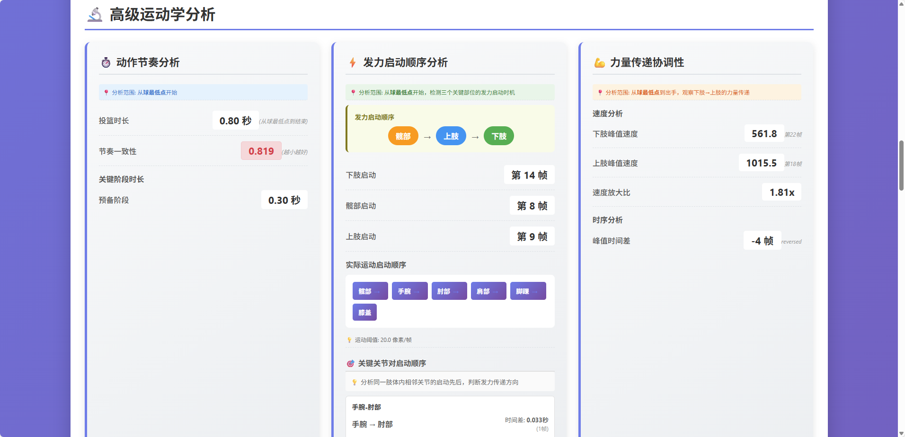

# 慧动分析 - AIMotionMind

基于计算机视觉的体育运动动作分析工具，提供关键帧检测、运动学分析和对比功能。

## 🎬 系统演示

### 关键帧检测与分析


### 关键帧比对


### 详细分析界面


### 数据可视化图表


### 高级分析功能


## 功能特性

- 🎯 **姿态检测**：使用 MediaPipe 进行实时姿态检测
- 📊 **运动学分析**：计算关节角度、速度和加速度
- 🔍 **关键帧识别**：自动检测投篮过程中的14个关键帧
- 📈 **高级分析**：节奏分析、发力顺序、能量传递效率
- 📝 **HTML报告**：生成可视化的分析报告
- 🔄 **对比分析**：两次投篮的关键帧对比

## 系统要求

- Python 3.8+
- OpenCV
- MediaPipe
- NumPy, Pandas
- Matplotlib, Seaborn
- Jinja2

## 安装

1. 克隆仓库
```bash
git clone <repository-url>
cd AIMotionMind
```

2. 创建虚拟环境（推荐）
```bash
python -m venv .venv
.venv\Scripts\activate  # Windows
source .venv/bin/activate  # Linux/Mac
```

3. 安装依赖
```bash
pip install -r requirements.txt
```

## 快速开始

### 1. 分析单个视频

```bash
python main.py
```

选择 `[1] 分析新视频`，按提示输入：
- 视频文件路径
- 帧提取间隔（默认5帧）
- 输出目录名称（可选）
- 是否生成HTML报告

### 2. 关键帧对比

```bash
python main.py
```

选择 `[2] 关键帧对比分析`，选择两个已完成的分析进行对比。

## 项目结构

```
├── core/                      # 核心模块
│   ├── video_processor.py     # 视频处理
│   ├── pose_detector.py       # 姿态检测
│   ├── data_manager.py        # 数据管理
│   └── report_generator.py    # 报告生成
├── sports/                    # 运动分析模块
│   └── basketball/
│       ├── shot_analyzer.py   # 投篮分析
│       ├── keyframe_detector.py  # 关键帧检测
│       ├── metrics.py         # 指标计算
│       └── keyframe_comparison.py  # 关键帧对比
├── templates/                 # HTML模板
│   ├── basketball_report.html
│   └── keyframe_comparison_report.html
├── config.py                  # 默认配置
├── config_examples.py         # 配置示例
├── main.py                    # 主程序入口
└── requirements.txt           # 依赖列表
```

## 配置说明

### 默认配置 (config.py)

```python
BASKETBALL_SHOT_CONFIG = {
    "sport_type": "basketball_shot",
    "frame_interval": 5,
    "joints_of_interest": [...],
    "angle_metrics": [...],
    "keyframes": [...],
    ...
}
```

### 自定义配置 (config_examples.py)

提供三种预设配置：
- `HIGH_PRECISION_CONFIG` - 高精度分析（每2帧提取）
- `FAST_PREVIEW_CONFIG` - 快速预览（每10帧提取）
- `LEFT_SIDE_SHOT_CONFIG` - 左手投篮配置

使用方法：
```python
from config_examples import HIGH_PRECISION_CONFIG
from sports.basketball.shot_analyzer import BasketballShotAnalyzer

analyzer = BasketballShotAnalyzer(HIGH_PRECISION_CONFIG)
```

## 输出说明

### 分析输出

```
output/basketball/analysis_YYYYMMDD_HHMMSS/
├── data/
│   ├── analysis_data.json     # 完整分析数据
│   ├── frames.csv             # 帧数据
│   ├── keyframes.csv          # 关键帧数据
│   ├── angles.csv             # 角度数据
│   └── velocities.csv         # 速度数据
├── frames/                    # 提取的帧图片
├── keyframes/                 # 关键帧图片
└── reports/
    └── basketball_analysis_report.html  # HTML报告
```

### 对比输出

```
output/basketball/comparison_reports/comparison_YYYYMMDD_HHMMSS/
├── comparison_data.json       # 对比数据
├── keyframe_images/           # 对比图片
└── keyframe_comparison.html   # 对比报告
```

## 关键帧说明

系统检测14个关键帧：

1. **球的最低点** - 投篮准备阶段，球处于最低位置
2. **开始持续抬球** - 开始向上抬球
3. **球上升中点** - 抬球过程的中间点
4. **球到胸部高度** - 球达到胸部位置
5. **重心最低点** - 下蹲最深处
6. **球到肩部高度** - 球达到肩膀位置
7. **腿部开始发力** - 腿部开始蹬伸
8. **力量传递** - 力量从下肢传递到上肢
9. **肘关节最大弯曲** - 肘部弯曲达到最大角度
10. **手腕下压** - 手腕开始snap动作
11. **出手准备** - 准备释放球
12. **肘关节伸展最快** - 肘部伸展速度最大
13. **出手瞬间** - 球离手的瞬间
14. **随球动作** - 出手后的跟随动作

## 分析指标

### 关节角度
- 膝关节角度
- 髋关节角度  
- 肘关节角度
- 肩关节角度
- 手腕角度
- 躯干倾斜角度

### 运动学参数
- 各关节点的速度
- 各关节点的加速度
- 角速度
- 角加速度

### 高级指标
- 节奏一致性
- 发力顺序正确性
- 发力链效率
- 能量传递效率

## 开发说明

### 添加新的运动项目

1. 在 `sports/` 下创建新目录
2. 实现分析器类，继承基础功能
3. 定义关键帧检测逻辑
4. 创建对应的配置文件
5. 添加HTML模板

### 扩展分析指标

在 `sports/basketball/metrics.py` 中添加新的计算函数。

## 常见问题

**Q: 视频检测不到人体姿态？**
A: 确保视频中人物清晰可见，尝试调整 `min_detection_confidence` 参数。

**Q: 关键帧检测不准确？**
A: 可以调整帧提取间隔，或修改关键帧检测阈值。

**Q: 如何分析左手投篮？**
A: 使用 `config_examples.py` 中的 `LEFT_SIDE_SHOT_CONFIG`。

## 许可证

MIT License

## 贡献

欢迎提交 Issue 和 Pull Request！

## 联系方式

如有问题，请提交 Issue。
